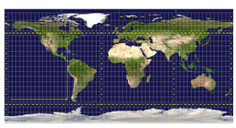
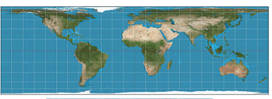
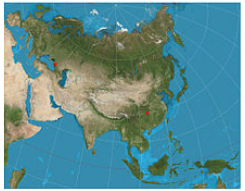
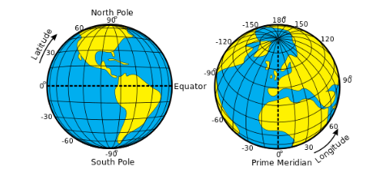
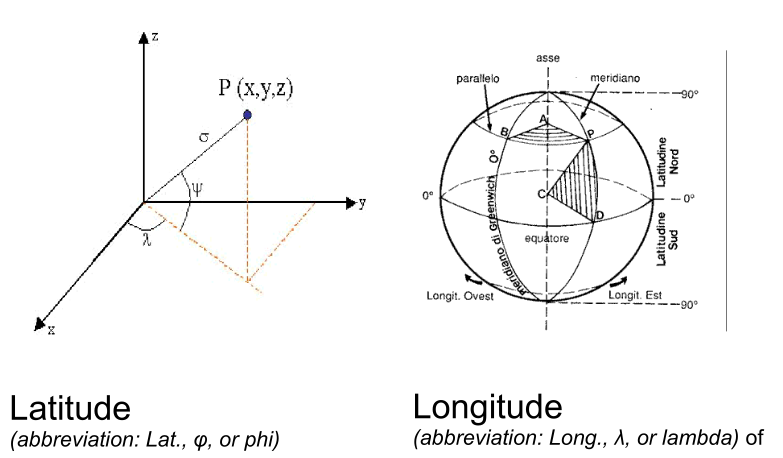
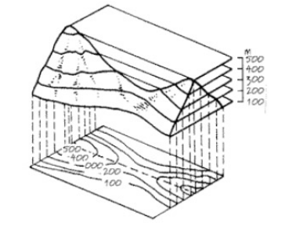
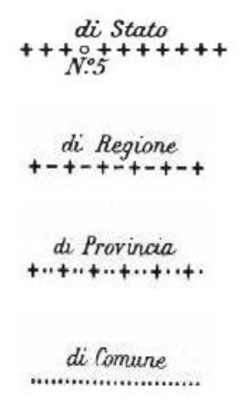

# Introduzione

## Geomatica
La geomatica è la disciplina di raccolta, salvataggio, elaborazione e consegna di informazioni geografiche, o spazialmente referenziate.

E' un termine relativamente recente, coniato da Pollock e Wright nel 1969. Essa include strumenti e tecniche usate nello studio del territorio, remote sensing, cartografia, sistemi GIS, sistemi di satelliti globali, fotogrammetria, geografia e altre forme di mappatura della Terra.

# Cartografia

## Definizione
La cartografia è lo studio e la pratica di produrre mappe. Combinando scienza, estetica e tecnica, la cartografia si basa sul fatto che la realtà può essere modellata in modi che comunichino le informazioni spaziali efficientemente.

## Scale delle mappe
Una mappa rappresenta una porzione della superficie terrestre. Dato che una mappa accurata rappresenta il terreno, ogni mappa ha una "scala" che indica il rapporto tra una certa distanza sulla mappa e la distanza sul suolo reale.

### Representative Fraction (FR)
Indica a quanto un certo numero di unità della superficie terrestre corrispondano sulla mappa. Può essere espressa cpme 1/100.000 o 1:100.000. In quwesto esempio, un centimetro sulla mappa equivale a 100.000 centimetri (1 chilometro) sulla terra.

### Graphic Scale
E' una rappresentazione visuale della scala della mappa.

### Larga scala o piccola scala
Una mappa in larga scala è una mappa che mostra maggiore dettaglio in quanto la frazione rappresentativa (come 1/25.000) è una frazione maggiore rispetto a una mappa in piccola scala, che avrebbe una frazione da 1/250.000 a 1/7.500.000. Le mappe a larga scala hanno una frazione rappresentativa di 1/50.000 o anche 1/10.000. Quelle tra 1/50.000 e 1/250.000 si dicono mappe a scala intermedia.

### Mappa Topografica

### Proiezioni
Una proiezioni di una mappa è un qualsiasi metodo di rappresentazione della superficia di una sfera o di un altro oggetto tridimensionale, su un piano.

Tutte le proiezioni di mappe distorcono la superficie originale in qualche modo. A dipendenza dallo scopo della mappa, alcune distorsioni sono accettabili e altre no; perciò diverse proiezioni esistono per preservare alcune proprietà di interesse del corpo studiato, a spese di altre.

Non c'è limite al numero possibile di proiezioni di una mappa.

Molte proprietà possono essere misurate sulla superficie terrestre:
* Area
* Forma
* Direzione
* Angoli
* Distanze
Le proiezioni di mappe possono essere costruite per preservare una o molteplici di queste proprietà, ma non tutte simultaneamente.

Lo scopo della mappa determina quale proiezione dovrebbe costituire la base per la mappa. Dato che una mappa può avere molti scopi diversi, molte diverse proiezioni sono state create per soddisfare questi scopi.

* Conformal: preserva gli angoli localmente (i.e UTM - Universal Transversal Mercator)

* Equal-Area: preserva le aree 

* Equidistant: preserva la distanza da un punto o una linea standard

## Coordinate

### Latitudine
La latitudine di un punto sulla terra indica il valore dell'angolo tra il piano equatoriale e una linea che passa attraverso quel punto ed è normale alla superficie di un elissoide di riferimento che approssima la forma della terra.

### Longitudine
La longitudine di un punto sulla terra indica l'angolo est o ovest da un meridiano di riferimento a un altro meridiano che passa attraverso quel punto.

### Coordinate Polari (sferoide) 

## Sistema di Riferimento a Coordinate
Un CRS è un sistema globale, regionale o locale, basato su coordinate, per localizzare entità geografiche.

Ci si può riferire a un CRS usando codici EPSG definiti dall' European Petroleum Surbey Group.

## Sistemi di Riferimento in Italia
Il sistema Gauss-Boaga è stato proposto dal prof. Giovanni Boaga, capo dell'Istituto Geografico Militare, nel 1940. Il sistema Gauss Boaga definisce anche il sistema geodetico Roma 40. Le mappe IGM a scala 1:25.000 sono state pubblicate usando le coordinata Gauss-Boaga, poi trasformate in UTM.
Sono coordinate metriche che esprimono un punto come una distanza dal vertice geodetico di Monte Mario.
Ci sono due zone principali in questo sistema, ovvero il fuso Ovest e il fuso Est. L'evoluzione della cartografia italiana ha poi adottato il sistema di coordinate UTM.

L'EPSG mantiene dati nei propri database di quasi tutti i CRS:
* Gauss-Boaga
* EPSG 3003 (fuso Ovest)
* EPSG 3004 (fuso Est)

L'Universal Transverse Mercator (UTM) usa un sistema cartesiano bidimensionale per localizzare entità sulla superficie Terrestre.

Il sistema UTM non è una singola proiezione cartografica. Il sistema invece divide la Terra in sessanta zone, ciascuna una fascia di sei gradi di longitudine, e utilizza una proiezione di Mercatore trasversa secante in ogni zona.

L'Italia è compresa in due principali fasce, l'UTM 32 e l'UTM 33 (+34).

Latitudine e longitudine vengono espresse in angoli (gradi, minuti e secondi).

### WGS
Il WGS 84 (World Geodetic System) è un sistema di riferimento a coordinate usato dal GPS (Global Positioning System).

## Simbologia
* Orografia
* Idrografia
* Amministrazione
* Urbanistica
* Strade
* Vegetazione
* Geodetica

### Orografia
* Isolinee e punti con altimetria
* Alla scala di 1:25.000 le curve di livello hanno un'equidistanza di 25 m.
* Alla scala di 1:10.000 le curve di livello hanno un'equidistanza di 10 m

### Idrografia
Fiumi, torrenti, sorgenti, laghi, mare, ecc.

### Amministrazione
Confini:

### Urbanistica
Costruzioni e molto altro...

## Leggere una mappa
1 Step
* Posizione geografica dell'area di studio
* Scala e dimensioni
* Equidistanza e linee di contorno

2 Step
* Prima definizione dei principali elementi di orografia
* Pendenza dei versanti
* Interpretazione analitica dell'orografia e dell'idrografia
* Affioramenti rocciosi
* idrologia e suoi modelli
* tipi di vegetazione
* elementi antropici

3 step
* Interpretazione delle forme e dei processi
    * geomorfologia
    * attività umane
    * elementi seminaturali
        * confronto con altre fonti: carte tematiche, dati statistici, bibliografia...

# Rilevamento Remoto

## Definizione
Il rilevamento remoto in generale può essere definito come la raccolta di informazioni da un oggetto o superficie, senza contatto diretto.

## Storia
* Nel 1858 il balloonista G. Tournachon realizzò fotografie di parigi dalla sua mongolfiera.
* La fotografia aerea sistematica si sviluppò per scopi militari e di ricognizione a partire dalla Prima Guerra Mondiale, raggiungendo il suo apice durante la Guerra Fredda.
* I satelliti artificiali nella seconda metà del XX secolo.

## Applicazioni
* Geologia
* Selvicoltura
* Agricoltura
* Idrologia
* Rilievi marini
* Copertura del suolo e uso del suolo
* Scopi militari

## Tipologie
* Rilevamento remoto PASSIVO: ad esempio tramite riflesso delle radiazioni solari o emesse da oggetti
    * Fotografia
    * Radiometri
    * Infrarossi
* Rilevamento remoto ATTIVO:
    * RADAR
    * LiDAR

## Elementi di Interpretazione di Immagini

### Forma
Molti elementi naturali e antropici hanno forme uniche. Spesso si usano aggettivi come lineare, curvilineo, circolare, ellittico, radiale, quadrato, rettangolare, triangolare, esagonale, a stella, allungato e amorfo.

## Ombra
La riduzione delle ombre è una questione importante nel telerilevamento poiché le ombre tendono a nascondere oggetti che altrimenti potrebbero essere individuati.
Tuttavia, l'ombrea proiettata da un oggetto può essere l'unico vero indizio sulla sua identità.
Le ombre possono anche fornire informazioni sull'altezza di un oggetto, sia in modo qualitativo sia quantitativo.

## Tono e colore
Una banda di radiazione elettromagnetica registrata da uno strumento di telerilevamento
può essere visualizzata in un’immagine in tonalità di grigio che vanno dal nero al bianco.
Queste tonalità sono chiamate “toni” e possono essere descritte qualitativamente
come scure, chiare o intermedie (l’occhio umano può distinguere circa 40–50 toni).
Il tono è legato alla quantità di luce riflessa dalla scena in un determinato intervallo
di lunghezze d’onda (banda).

## Texture
La texture si riferisce alla disposizione del tono o del colore in un’immagine.
È utile perché le caratteristiche della superficie terrestre che presentano toni simili
spesso mostrano texture diverse.
Gli aggettivi utilizzati includono liscio (uniforme, omogeneo),
intermedio e ruvido (grossolano, eterogeneo).

## Altezza e profondità
Come già discusso, le ombre possono spesso fornire indizi sull’altezza degli oggetti.
A loro volta, le altezze relative possono essere utilizzate per interpretare gli oggetti.
In modo simile, anche le profondità relative possono spesso essere interpretate.
Le descrizioni includono alto, intermedio e basso; profondo, intermedio e superficiale.

## Associazione
Questo aspetto è molto importante quando si cerca di interpretare un oggetto o un’attività.
L’associazione si riferisce al fatto che alcune caratteristiche e attività sono quasi sempre
collegate alla presenza di altre specifiche caratteristiche e attività.

